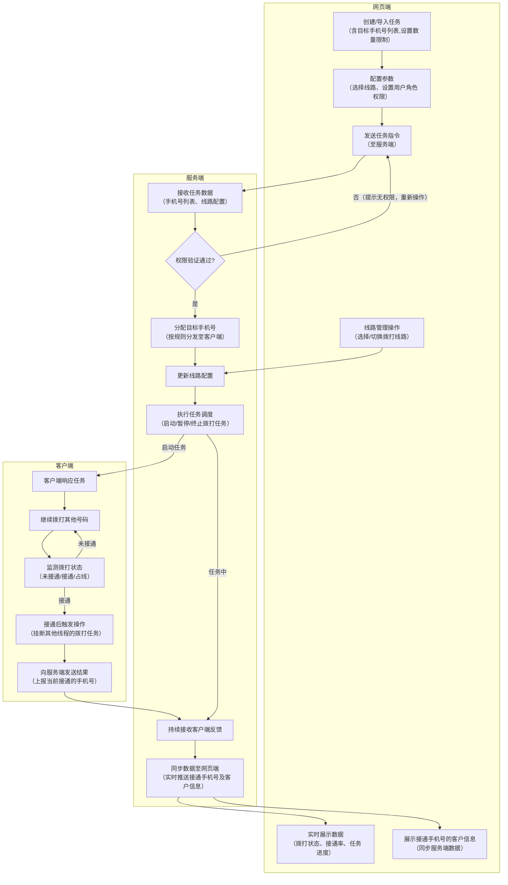

# 群呼流程图

## 流程图

```mermaid
graph TD
    subgraph 网页端
        W1[创建/导入任务<br>（含目标手机号列表,设置数量限制）]
        W2[配置参数<br>（选择线路、设置用户角色权限）]
        W3[发送任务指令<br>（至服务端）]
        W4[实时展示数据<br>（拨打状态、接通率、任务进度）]
        W5[展示接通手机号的客户信息<br>（同步服务端数据）]
        W6[线路管理操作<br>（选择/切换拨打线路）]
    end

    subgraph 服务端
        S1[接收任务数据<br>（手机号列表、线路配置）]
        S2[验证用户角色权限<br>（基于网页端配置）]
        S3[分配目标手机号<br>（按规则分发至客户端）]
        S4[管理线路资源<br>（根据网页端选择分配线路）]
        S5[执行任务调度<br>（启动/暂停/终止拨打任务）]
        S6[接收客户端反馈<br>（拨打状态、接通结果）]
        S7[同步数据至网页端<br>（实时推送接通手机号及客户信息）]
    end

    subgraph 客户端
        C1[连接SIP服务端<br>（建立通信链路）]
        C2[启动多线程拨打<br>（接收服务端分配的手机号）]
        C3[监测拨打状态<br>（未接通/接通/占线）]
        C4[接通后触发操作<br>（挂断其他线程的拨打任务）]
        C5[向服务端发送结果<br>（上报当前接通的手机号）]
    end


    W1 --> W2 --> W3 --> S1
    S1 --> S2{权限验证通过?}
    S2 -->|是| S3 --> S4 --> S5
    S2 -->|否（提示无权限，重新操作）| W3
    S5 -->|启动任务| C1[客户端响应任务]
    C1 --> C2 --> C3
    C3 -->|接通| C4 --> C5 --> S6
    C3 -->|未接通| C2[继续拨打其他号码]
    S6 --> S7 --> W4 & W5
    W6 --> S4[更新线路配置]
    S5 -->|任务中| S6[持续接收客户端反馈]
```